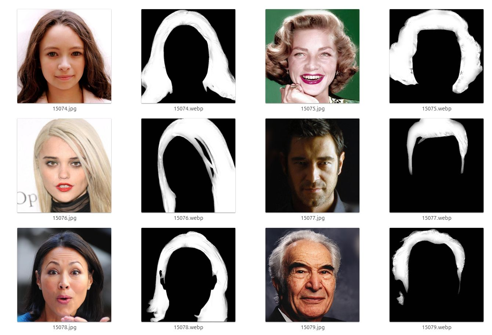

# CelebAHairMask-HQ

**CelebAHairMask-HQ** is a *extended dataset* of CelebAMask-HQ for hair segmentation or hair matting.

**CelebAMask-HQ** is a large-scale face image dataset that has **30,000** high-resolution face images selected from the CelebA dataset by following CelebA-HQ. Each image has segmentation mask of facial attributes corresponding to CelebA.

The masks of CelebAHairMask-HQ were auto-annotated with the size of **1024 x 1024**. 

CelebAHairMask-HQ can be used to **train and evaluate algorithms of hair segmentation, hair recognition, and GANs for hair generation and editing**.

* more information about CelebAMask-HQ, see https://github.com/switchablenorms/CelebAMask-HQ 

## Sample Images

## Sample Mask

## CelebAHairMask-HQ Dataset Downloads

### Version 1.0 PLUS, released on 03/01/2025

* [downloading link](https://huggingface.co/datasets/cpuimage/CelebAHairMask-HQ)

🌟 Hey everyone!

Your passion turned this project into something amazing—despite no external support. 🌟

V1 Plus​ may feel final, but it’s your gift to the community. 

If you’ve found value here, let’s keep it alive:

1️⃣ Share it → Social media, forums, or word of mouth!
2️⃣ Star the repo → Every star matters ✨
3️⃣ Suggest ideas or fix a typo → Even tiny PRs count!

No effort is too small. 💪

- 📫 Reach me:
  - gaozhihan@vip.qq.com

## Related Works

* **CelebA** dataset:
  Ziwei Liu, Ping Luo, Xiaogang Wang and Xiaoou Tang, "Deep Learning Face Attributes in the Wild", in IEEE International Conference on Computer Vision (ICCV), 2015 

* **CelebA-HQ** was collected from CelebA and further post-processed by the following paper :
  Karras et. al, "Progressive Growing of GANs for Improved Quality, Stability, and Variation", in Internation Conference on Reoresentation Learning (ICLR), 2018

* **CelebAMask-HQ** dataset: 
  Lee, Cheng-Han and Liu, Ziwei and Wu, Lingyun and Luo, Ping, "MaskGAN: Towards Diverse and Interactive Facial Image Manipulation", in IEEE Conference on Computer Vision and Pattern Recognition (CVPR), 2020

## Dataset Agreement

* The CelebAHairMask-HQ dataset is available for **non-commercial research purposes** only.
* You agree **not to** reproduce, duplicate, copy, sell, trade, resell or exploit for any commercial purposes, any portion of the images and any portion of derived data.
* You agree **not to** further copy, publish or distribute any portion of the CelebAHairMask-HQ dataset. Except, for internal use at a single site within the same organization it is allowed to make copies of the dataset.

## License and Citation

The use of this software is RESTRICTED to **non-commercial research and educational purposes**.
